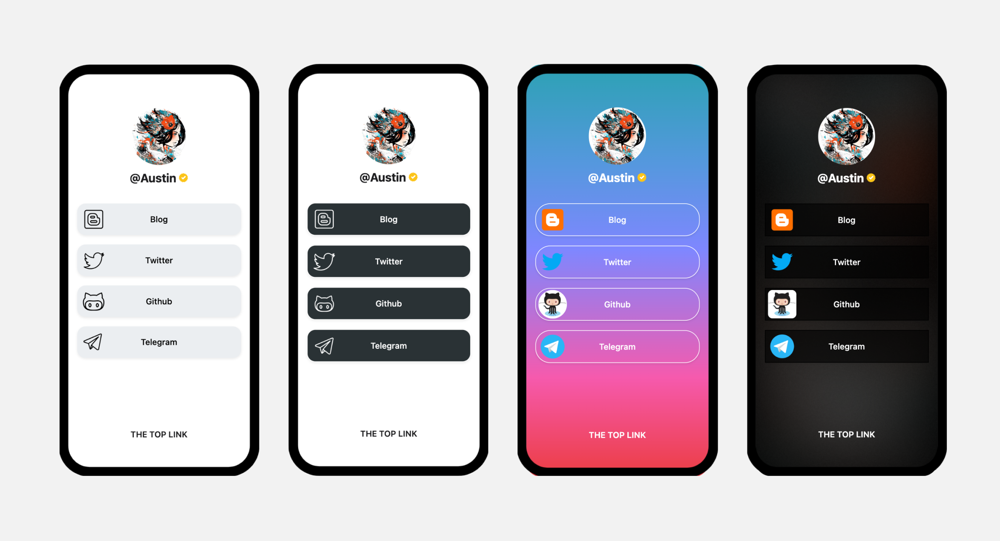
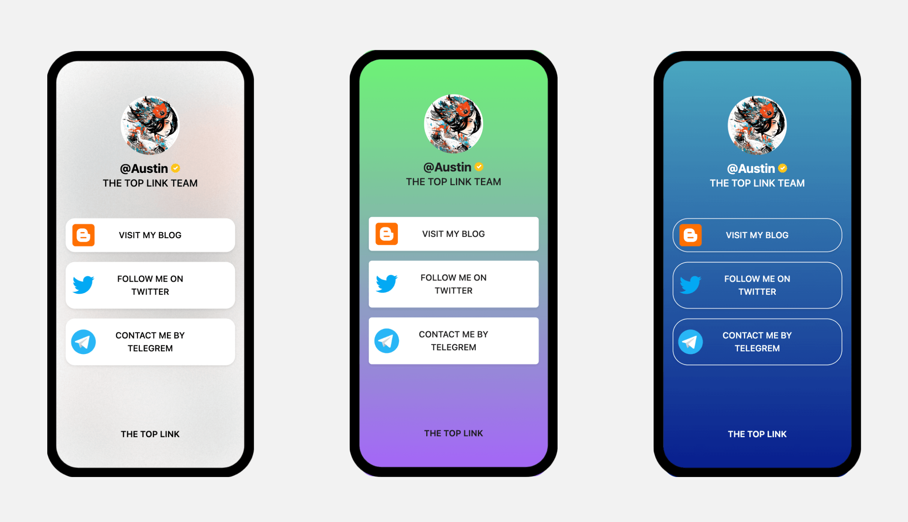

## 简介

你好，这里是 TOP LINK 代码开源的后端部分。
主要技术栈为 Python + FastAPI + MySQL。

## 1. TOP LINK 是什么?  

答：TOP LINK是一款免费的聚合链接的互联网数字身份应用，目前支持中英双语，全平台外链聚合。旨在为创作者、品牌、IP、独立开发者等提供多平台聚合页面。

## 2. 为什么是THE TOP？  

答：THE.TOP短链域名便于记忆和展示；主题页面更加的优雅；媲美同类网站聚合页面应用（迭代ing）；并同时深化探索服务，使网站更具有社交和推广属性，让更多人的用户找到您。

